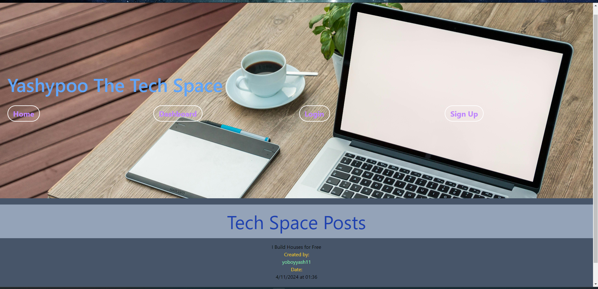

# Yashypoo The Tech Space

## Yash's blog post for tech minds and alike!

Table of Contents
  
  * [Description](#description)
  * [Installation](#installation)
  * [How to use](#usage)
  * [Features](#features)
  * [License](#licenseSection)
  * [Github](#gitHub)
  * [Youtube Demo](#youtube)
  * [Contact](#Contact!)

### Description   
Yashypoo The Tech Space is a comprehensive application tailored for developers to create and share blog posts while engaging in discussions through comments on each other's content. Developed from the ground up, it adheres strictly to the Model-View-Controller (MVC) paradigm for its architecture. The application utilizes Handlebars.js for templating, Sequelize as the Object-Relational Mapping (ORM) tool, and incorporates the express-session npm package for authentication purposes.

This platform effectively addresses the need for a Content Management System (CMS)-style blog site, enabling users to publish articles, blog posts, and express their thoughts or opinions seamlessly. Key insights gained from developing Yashypoo include understanding the various methods to target IDs within handlers, leveraging handlers to extract values from the Handlebars body and interact with API endpoints, utilizing built-in helpers for displaying pages exclusively for logged-in users, and recognizing the organizational benefits offered by MVC, particularly in terms of separating business logic from display concerns, thereby enhancing maintainability.

### Installation

To enhance security, protect the database credentials by storing them as environmental variables in the .env file. Set DB_USER='' to 'root' and DB_PASSWORD='' to 'MySQL Root Password'. This setup safeguards sensitive information and facilitates connection to the database using Sequelize.

Begin by installing dependencies. Navigate to the main directory in the terminal and execute "npm i".

Next, create the database schema. Access the MySQL shell by running "mysql -u root -p" in the terminal. When prompted, enter the MySQL Root Password. Once connected, import the schema.sql file by executing "source db/schema.sql;". This action initializes the development database. Type "Quit" to exit the MySQL connection.

Finally, seed the database to populate it with initial data. Run "npm run seed" in the terminal. This step ensures that routes can be effectively tested using Insomnia.
  
### How to use  

To initiate the application from the terminal, execute "npm run start" to launch the server. Access the application via the URL link http://localhost:3001. Upon opening the page, the homepage will showcase all blog posts along with their content, user, and creation date.

Navigation links located in the upper right corner include "Home," "Dashboard," and "Login." "Home" redirects to the homepage, while "Dashboard" allows logged-in users to create new blogs and view their existing ones. If logged out, clicking "Dashboard" redirects to the "Login" page. "Login" provides access to the Login and Signup pages. Upon creating a username and password with a minimum of 8 characters, user information is stored in the database and the user is logged in.

In the "Dashboard," users can create a new blog by inputting text in the Title and Content text boxes and clicking "Create." The right column displays Current Blogs, showcasing each blog created by the logged-in user. Clicking on a blog under Current Blogs opens an Edit Blog page where the title and content can be updated. Users can click "Update" to save changes or "DELETE" to remove the blog.

On the homepage, clicking on a blog post from the list displays the title, content, user, creation date, and Comment History. Users can add comments by entering text in the "Add a comment" field and clicking "Submit." Comments are saved and displayed beneath the Comment History, including the comment, user, and creation date.

If logged out or the session cookie expires, an alert will notify the user of a "Failed to create comment," redirecting them to the "Login" page. Non-logged-in users can view blog posts but are redirected to "Login" when attempting to create, update, or delete a blog, or add a comment.

To run the application on Heroku, open the deployed application URL and follow the aforementioned instructions from the homepage.

### Features 

* User Authentication and Authorization: The website offers user registration and login functionalities, ensuring that only authenticated users can access certain features like creating, updating, and deleting blog posts, as well as adding comments. This feature enhances security and personalization.

* Blog Management: Users can create new blog posts, view their existing posts, and edit or delete them as needed. The website provides a dashboard interface for managing blog content, simplifying the process of organizing and maintaining posts.

* Commenting System: Visitors can engage with blog posts by leaving comments. The website includes a commenting system that allows users to submit comments, which are then displayed alongside the respective blog post. This feature promotes interaction and community engagement.

* Responsive Design: The website is designed to be responsive, meaning it adapts its layout and functionality based on the device being used to access it. Whether users are browsing on desktops, tablets, or mobile phones, they can enjoy a seamless experience, improving accessibility and user satisfaction.

  
#### Project License: MIT  
https://opensource.org/licenses/MIT

### Github 

https://github.com/yoboyyash/Yashypoo-Tech-Blog-  
   
### Youtube 
Youtube demo for this project: 

https://youtube.com 

# Contact me!  

Yash Baviskar: yashrajbaviskar@gmail.com